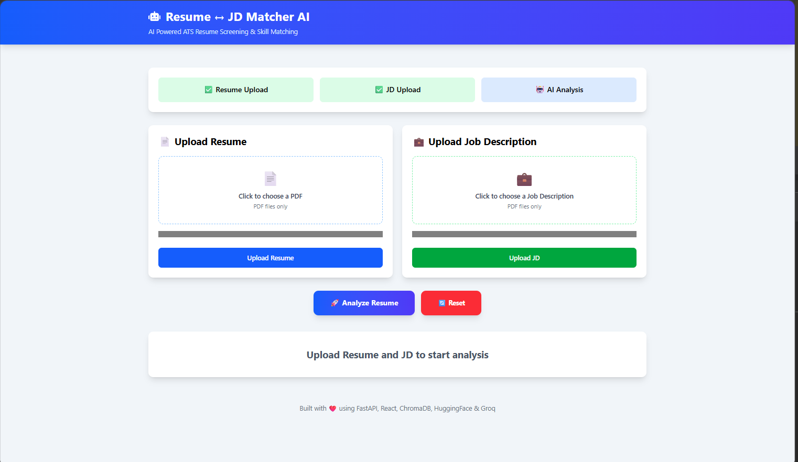
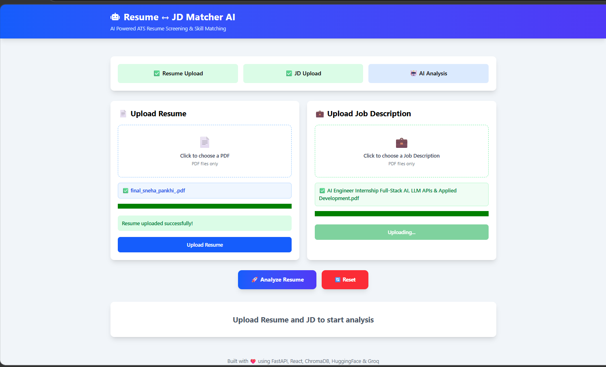
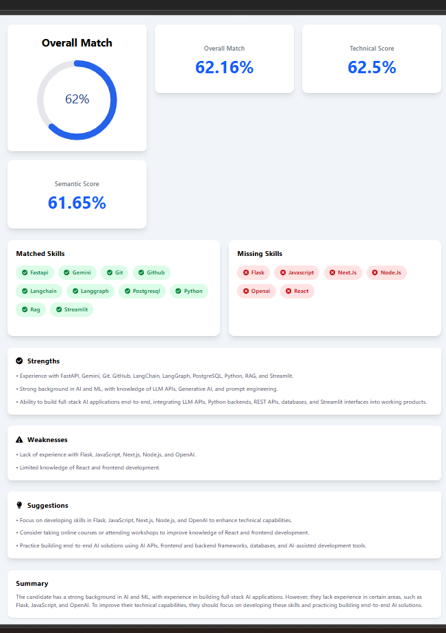

# 🚀 Resume ↔ JD Matcher AI

An AI-powered Resume ↔ Job Description Matcher that evaluates how well a resume matches a job description using **Retrieval-Augmented Generation (RAG)**, **Hybrid Search**, **Vector Embeddings**, and **Large Language Models (LLMs)**.

The application provides ATS-style match scores, identifies matched and missing skills, and generates AI-powered strengths, weaknesses, suggestions, and a professional summary to help candidates improve their resumes.

---

# 🎥 Demo


https://github.com/user-attachments/assets/e59033e9-3aa4-4adb-8822-c6ab6a7c97da


---

# 📸 Screenshots

## Home Page



---

## Upload Resume & Job Description



---


## AI Insights



---

# ✨ Features

- 📄 Resume Upload (PDF)
- 💼 Job Description Upload (PDF)
- 🔍 Hybrid Search (Semantic + Keyword Search)
- 🧠 Retrieval-Augmented Generation (RAG)
- 📊 ATS Match Score
- 💯 Technical Skill Score
- 🤖 Semantic Similarity Score
- ✅ Matched Skills Detection
- ❌ Missing Skills Detection
- 💡 AI-generated Strengths
- ⚠️ AI-generated Weaknesses
- 🚀 Personalized Improvement Suggestions
- 📝 AI-generated Professional Summary
- 🔄 Reset Analysis
- 📱 Responsive UI
- 🎨 Modern Dashboard

---

# 🧠 AI Pipeline

```text
Resume PDF
        │
        ▼
PDF Loader
        │
        ▼
Document Chunking
        │
        ▼
HuggingFace Embeddings
        │
        ▼
ChromaDB Vector Store
        │
        ├─────────────┐
        ▼             ▼
 Vector Search    Keyword Search
        │             │
        └──────┬──────┘
               ▼
         Hybrid Retrieval
               │
               ▼
       Relevant Context
               │
               ▼
 Skill Extraction & Matching
               │
               ▼
 ATS Score Calculation
               │
               ▼
         Groq LLM Analysis
               │
               ▼
      React Dashboard
```

---

# 🛠 Tech Stack

## Frontend

- React.js
- Vite
- Tailwind CSS
- Axios
- React Icons
- React Circular Progressbar

## Backend

- FastAPI
- Python
- LangChain
- ChromaDB
- HuggingFace Embeddings
- Groq LLM
- Pydantic

## AI & NLP

- Retrieval-Augmented Generation (RAG)
- Hybrid Search
- Semantic Search
- Vector Embeddings
- Prompt Engineering
- Skill Matching
- Cosine Similarity

---

# 📂 Project Structure

```text
resume-jd-matcher/

├── backend/
│   ├── app/
│   │   ├── api/
│   │   ├── core/
│   │   ├── prompts/
│   │   ├── rag/
│   │   ├── schemas/
│   │   ├── services/
│   │   ├── utils/
│   │   └── main.py
│   │
│   └── uploads/
│
├── frontend/
│   ├── src/
│   │   ├── components/
│   │   ├── pages/
│   │   ├── services/
│   │   ├── styles/
│   │   ├── App.jsx
│   │   └── main.jsx
│
├── screenshots/
│
└── README.md
```

---

# ⚙️ Installation

## Clone Repository

```bash
git clone <repository-url>

cd resume-jd-matcher
```

---

## Backend

```bash
python -m venv venv

venv\Scripts\activate

pip install -r requirements.txt

uvicorn backend.app.main:app --reload
```

Backend URL

```
http://localhost:8000
```

Swagger

```
http://localhost:8000/docs
```

---

## Frontend

```bash
cd frontend

npm install

npm run dev
```

Frontend URL

```
http://localhost:5173
```

---

# 🚀 How It Works

1. Upload Resume PDF
2. Upload Job Description PDF
3. Resume & JD are validated
4. Documents are chunked
5. Embeddings are generated
6. Chunks are stored in ChromaDB
7. Hybrid Search retrieves relevant context
8. Skills are extracted & matched
9. ATS score is calculated
10. Groq LLM generates insights
11. Results are displayed in the dashboard

---

# 📊 Analysis Output

The application generates:

- Overall Match Score
- Technical Skill Score
- Semantic Similarity
- Resume Skills
- JD Skills
- Matched Skills
- Missing Skills
- Strengths
- Weaknesses
- Suggestions
- Professional Summary
- Domain Match
- Analysis Confidence

---

# 🧮 Score Calculation

Overall Score is calculated using:

- Technical Skill Match
- Semantic Similarity
- Resume & JD Analysis

---

# 💡 Why Hybrid Search?

Instead of relying only on vector similarity, the project combines:

- 🔍 Semantic Vector Search (Embeddings)
- 📝 Keyword-based Search

This improves retrieval accuracy by capturing both semantic meaning and exact keyword matches, leading to more reliable AI analysis.

---

# 🔮 Future Improvements

- Redis Queue
- Background Workers
- Celery
- Authentication
- Resume History
- PDF Report Export
- Drag & Drop Upload
- Cloud Deployment
- Docker
- Kubernetes

---

# 📚 What I Learned

- FastAPI
- React
- Tailwind CSS
- LangChain
- ChromaDB
- RAG
- Hybrid Search
- HuggingFace Embeddings
- Prompt Engineering
- Groq LLM
- Vector Databases
- REST APIs
- Session Management
- AI-powered Resume Analysis

---

# 👩‍💻 Author

## Sneha Pankhi

B.E. Computer Science Engineering (AI & ML)

Passionate about:

- Generative AI
- LLM Applications
- Retrieval-Augmented Generation (RAG)
- Hybrid Search
- Full-Stack AI Development

---

# ⭐ Support

If you found this project useful, consider giving it a ⭐ on GitHub.

It motivates me to build and share more AI projects.